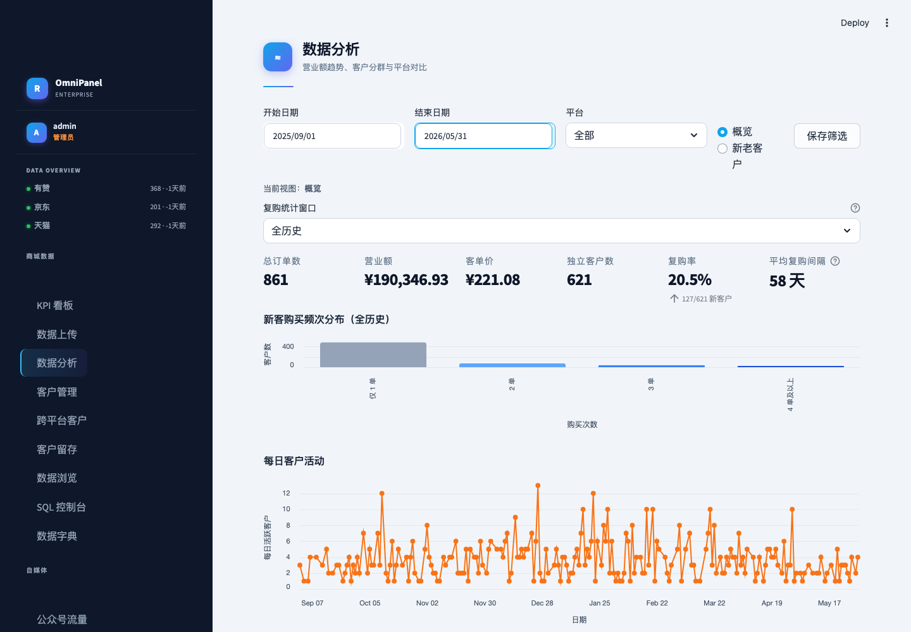
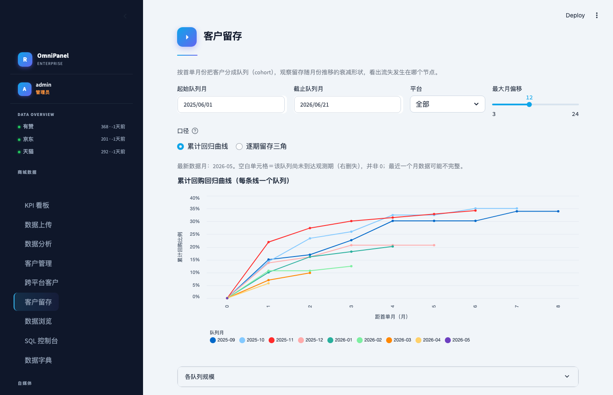
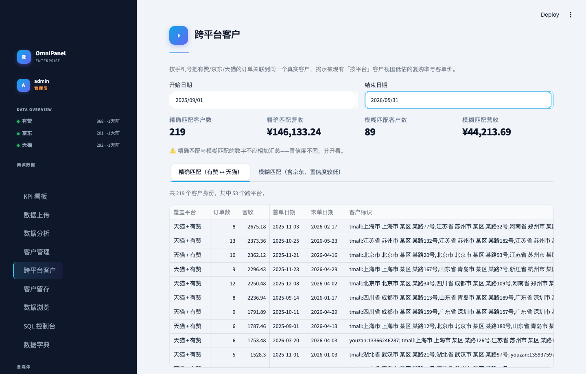
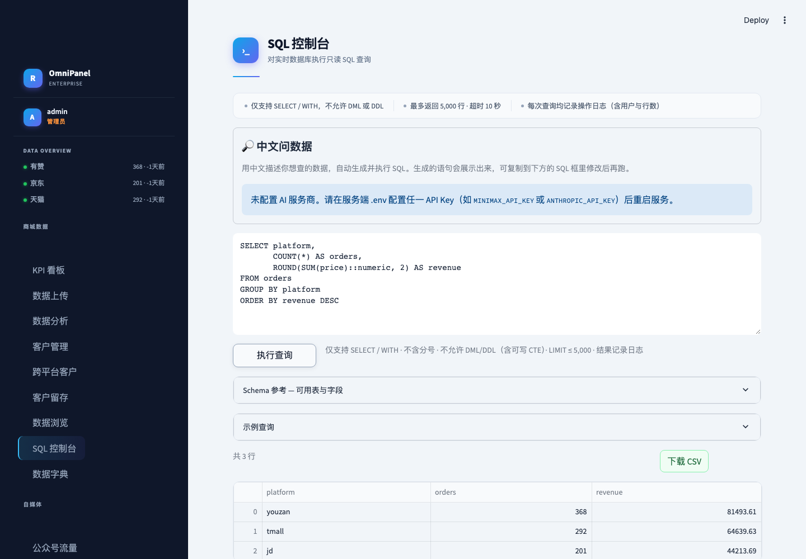
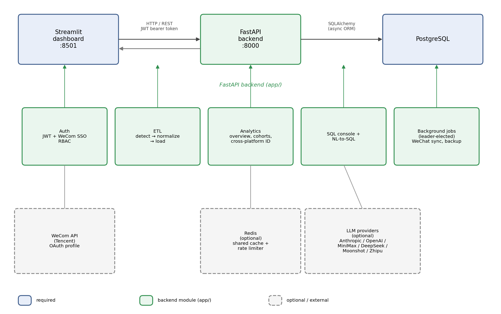

# OmniPanel

**Turn your e-commerce and self-media platform exports into clean dashboards, customer analytics, and natural-language queries — self-hosted, zero scraping.**

[](https://github.com/Nanboy-Ronan/OmniPanel/actions/workflows/ci.yml)
[](LICENSE)
[](https://www.python.org/)
[](https://www.postgresql.org/)
[](CONTRIBUTING.md)
[](https://github.com/Nanboy-Ronan/OmniPanel/stargazers)

[English](README.md) | [中文](README.zh-CN.md)

---

## What is OmniPanel?

You sell on platforms like Youzan, JD, and Tmall, and you create content on WeChat Official Accounts, Xiaohongshu (XHS), and Zhihu. Each platform lets you export data — but what you get are spreadsheets with dozens of differently-named columns. "Customer" doesn't mean the same thing across platforms. Some metrics are cumulative. The same order might appear in multiple rows and needs de-duplication.

General-purpose BI tools (Tableau, Metabase, etc.) won't handle this for you. They draw charts on whatever schema you hand them — whether the numbers are right is your problem.

**OmniPanel handles the correctness layer for you.** Upload your export files and it automatically:

- 🏷️ **Identifies the platform** — column fingerprinting detects whether a file came from Youzan, JD, or Tmall; no manual selection needed
- 🔄 **Normalizes** — maps every platform's columns onto one unified schema (customer, amount, date, region, etc.)
- 📊 **Gives you analytics** — dashboards, customer profiles, cohort retention, cross-platform identity resolution, a SQL console, and natural-language queries

All data comes from **official platform exports** — the files you already legally own. No scraping, no grey areas. OmniPanel just makes them actually usable.

### How it works, in three steps

```
You have export files ──→ Upload ──→ OmniPanel detects, cleans, stores ──→ Dashboards & analytics
```

1. **Export** — download your order spreadsheets from Youzan / JD / Tmall, or content data from WeChat OA / XHS / Zhihu
2. **Upload** — drop them into OmniPanel. It auto-detects the source platform, normalizes everything, and stores it — while keeping the original rows for traceability
3. **Analyze** — open the dashboards, write SQL in the console, or ask questions in plain Chinese ("what was the repurchase rate in Guangdong last month?")

---

## Screenshots

> All data shown is randomly generated; not a real business.

| Customer analytics | Cohort retention |
|---|---|
|  |  |

| Cross-platform customer identity | SQL console |
|---|---|
|  |  |

---

## Features

### Data ingestion

| Type | Platforms | How |
|---|---|---|
| E-commerce orders | Youzan, JD, Tmall | Upload official exports (.xlsx/.xls/.csv); auto-detected by column fingerprint |
| WeChat OA | WeChat Official Accounts | Automatic API sync (daily scheduled pull), no manual steps needed |
| Content platforms | Xiaohongshu (XHS), Zhihu | Upload official exports or use the built-in automated collector agent |

> Content-hash de-duplication means re-uploading the same file is safe — no duplicates.

### E-commerce analytics

- **Customer overview** — new vs. returning, repurchase rate and time-to-repurchase, per-customer order history, regional distribution
- **Cohort retention** — monthly cohorts with right-censored retention curves
- **Order browser** — searchable, exportable view of all normalized orders
- **Cross-platform customer identity** — merge the same person's orders across Youzan, JD, and Tmall by phone number, with explicit exact/fuzzy confidence tiers (JD masks phone numbers; the fuzzy tier uses partial fingerprint matching and is structurally separate from the exact tier)

### Content analytics

- **WeChat traffic** — daily reads, shares, followers; trends and comparisons
- **Content-to-sales impact** — correlate publish dates with order volume to measure content-driven sales

### Query layer

- **SQL console** — read-only ad-hoc queries with strict guardrails: SELECT/WITH only, auto `LIMIT` injection, statement timeout, full audit logging. Save and share frequently-used queries.
- **Natural-language queries (NL-to-SQL)** — ask questions in plain Chinese and get back generated SQL + results. Pluggable LLM provider support (Anthropic, OpenAI, MiniMax, DeepSeek, Moonshot, Zhipu); API keys stay server-side and users pick provider/model from a dropdown.

### Security & operations

- **Three roles** — viewer (read-only) / analyst (upload + analyze) / admin (user management, DB operations)
- **Enterprise WeChat SSO** — optional QR-code login
- **Audit log** — every query and mutating action is written to an append-only operation log
- **Background jobs** — scheduled WeChat metric sync and monthly DB backups, leader-elected for multi-worker safety
- **Watchdog** — daily health check on background pipelines; alerts via WeCom bot if anything stops

---

## Why official exports, not scraping?

Scraper-based tools have three fundamental problems:

- **Legal risk** — they operate in a grey area, and platform ToS policies vary
- **Fragility** — they break every time a platform redesigns its pages or tightens anti-bot measures
- **Maintenance burden** — you need to track frontend changes across every platform

OmniPanel only ingests the authorized, structured exports you already legally own — stable format, no frontend churn. It spends its effort on the correctness layer that generic BI tools skip, instead of fighting anti-bot systems.

<details>
<summary>How this compares to similar projects</summary>

| Project | Data source | What it ships |
|---|---|---|
| **OmniPanel** (this repo) | Official exports (Youzan/JD/Tmall, WeChat OA/XHS/Zhihu) | Self-hosted app: dashboards, cohort/identity analytics, SQL console, NL-to-SQL |
| [DA_Multi_Agent_Workflow](https://github.com/liuchaoqi-7/DA_Multi_Agent_Workflow) | Platform APIs + crawlers (Douyin Shop, XHS, WeChat Channels, ad platforms) | n8n-orchestrated multi-agent ETL/analytics pipeline synced into Feishu |
| [ECommerceCrawlers](https://github.com/DropsDevopsOrg/ECommerceCrawlers) | Web scraping (Taobao, Xianyu, Weibo, 20+ sites) | Scraper code samples; not a deployable product |
| [data-api (Just One API)](https://github.com/justoneapi/data-api) | Web scraping, 40+ platforms | Hosted pay-per-call data feed; no analytics layer |
| [bodapi global-ecommerce-data-scraping-solutions-cn](https://github.com/bodapi/global-ecommerce-data-scraping-solutions-cn) | Web scraping with anti-bot bypass, 20+ global platforms | Hosted cross-border data service |

See [docs/comparison.md](docs/comparison.md) for a detailed breakdown.

</details>

---

## Architecture

```
Browser (Streamlit, :8501) ──→ Backend API (FastAPI, :8000) ──→ PostgreSQL
                                        │
                                   ┌────┴────┐
                                   │  Redis    │ (optional, cache / rate limiting)
                                   │  LLM API  │ (optional, NL-to-SQL)
                                   └──────────┘
```



| Layer | Technology | Role |
|---|---|---|
| Frontend | Streamlit (`app/ui/`) | Thin client — renders backend data; no business logic |
| Backend | FastAPI (`app/`) | Auth, ETL, analytics, SQL console, background jobs |
| Database | PostgreSQL + SQLAlchemy | Unified normalized schema; raw platform rows preserved alongside |
| Cache | Redis (optional) | Distributed cache and login rate limiter; falls back to in-process |

See [Architecture](docs/architecture.md) for full details.

---

## Quick start

### Docker (recommended)

Requires Docker + Docker Compose v2. Starts Postgres, FastAPI, and Streamlit together — no local Python or Postgres needed.

```bash
git clone https://github.com/Nanboy-Ronan/OmniPanel.git
cd OmniPanel
cp .env.example .env
#    edit .env: set RAP_SECRET to a strong random value
#    python -c "import secrets; print(secrets.token_urlsafe(48))"
docker compose up --build
```

Open http://localhost:8501, register the first user (auto-promoted to admin), and start uploading exports.

### Manual setup

Requires Python 3.13+ and PostgreSQL 13+.

```bash
# 1. Clone and install
git clone https://github.com/Nanboy-Ronan/OmniPanel.git
cd OmniPanel
python -m venv .venv && source .venv/bin/activate
pip install -r requirements.txt

# 2. Configure
cp .env.example .env
#    edit .env: set RAP_DATABASE_URL, RAP_SECRET, and (optionally) an LLM API key

# 3. Apply database migrations
make db-upgrade            # or: alembic upgrade head

# 4. Start the backend (FastAPI on :8000)
uvicorn app.main:app --host 0.0.0.0 --port 8000

# 5. In another terminal, start the frontend (Streamlit on :8501)
streamlit run app/ui/dashboard.py
```

Full walkthrough: [Getting started](docs/getting-started.md).

---

## Configuration

All settings are environment variables (full list in `.env.example`).

### Essentials

| Variable | Purpose |
|---|---|
| `RAP_DATABASE_URL` | PostgreSQL connection string |
| `RAP_SECRET` | JWT signing key — **must be changed**; generate with `python -c "import secrets; print(secrets.token_urlsafe(48))"` |
| `RAP_SECRET_PREVIOUS` | Previous `RAP_SECRET` values (comma-separated), used to validate old tokens during key rotation |
| `FORWARDED_ALLOW_IPS` | Trusted proxy IPs when behind a reverse proxy (default `127.0.0.1`) |

### Enabling NL-to-SQL

Configure an API key for any supported provider. Users pick provider and model from a dropdown. Keys never leave the server.

```dotenv
NL_SQL_PROVIDER=minimax            # default provider
MINIMAX_API_KEY=eyJ...             # or ANTHROPIC_API_KEY / DEEPSEEK_API_KEY / etc.
```

With no keys configured, the feature returns 503; nothing else is affected.

### Secret rotation

Changing `RAP_SECRET` directly logs out every user. Use `RAP_SECRET_PREVIOUS` for zero-downtime rotation:

1. Generate a new secret, move the current `RAP_SECRET` value into `RAP_SECRET_PREVIOUS`, set `RAP_SECRET` to the new value, and restart.
2. Wait at least `TOKEN_LIFETIME_SECONDS` (default 24h) for all old tokens to expire.
3. Remove `RAP_SECRET_PREVIOUS` and restart.

> If the old secret is suspected compromised (vs. routine rotation), skip the wait in step 2 and act immediately.

---

## Documentation

| Doc | Contents |
|---|---|
| [Getting started](docs/getting-started.md) | Install, configure, run, create your first admin |
| [Architecture](docs/architecture.md) | Components, data model, ETL pipeline, roles, API surface, full config reference |
| [NL-to-SQL](docs/nl-to-sql.md) | How it works, provider registry, adding a provider |
| [Testing](docs/testing.md) | Running the suite, synthetic dataset |
| [WeChat auto-sync](docs/wechat-auto-sync.md) | Daily background sync for official-account metrics |
| [Creator-portal collector](docs/collector.md) | Playwright automation for XHS/Zhihu creator-backend exports |
| [Dependency maintenance](docs/maintenance.md) | Upgrade cadence, critical packages |
| [Project comparison](docs/comparison.md) | Honest pros/cons vs. scraper-based and agent-workflow alternatives |

---

## Roadmap

In progress:

- **Douyin Shop & WeChat Video Channels** — tracking for stable official export availability
- **Feishu / DingTalk push** — send saved query results to team collaboration tools

Under consideration (join the [Discussion](https://github.com/Nanboy-Ronan/OmniPanel/discussions)):

- Multi-step NL-to-SQL with agent routing for ambiguous or multi-hop questions
- Data warehouse layering (ODS → DWD → DIM → ADS)
- Usage visualization on the admin dashboard

---

## Contributing

Issues and PRs are welcome. See [CONTRIBUTING.md](CONTRIBUTING.md) for:

- Local dev environment setup
- Code style and commit conventions
- Adding a platform connector or NL-to-SQL provider
- The PR checklist

---

## Community & Support

- **Questions & discussion** — [GitHub Discussions](https://github.com/Nanboy-Ronan/OmniPanel/discussions)
- **Bugs & feature requests** — [GitHub Issues](https://github.com/Nanboy-Ronan/OmniPanel/issues)
- **Security vulnerabilities** — see [SECURITY.md](SECURITY.md); please don't open a public issue

---

## License

OmniPanel is licensed under the [GNU Affero General Public License v3.0](LICENSE) (AGPL-3.0).

You may freely use, modify, and self-host OmniPanel. Distributing a modified version, or running it as a network service, requires making the source code available under the same license.
