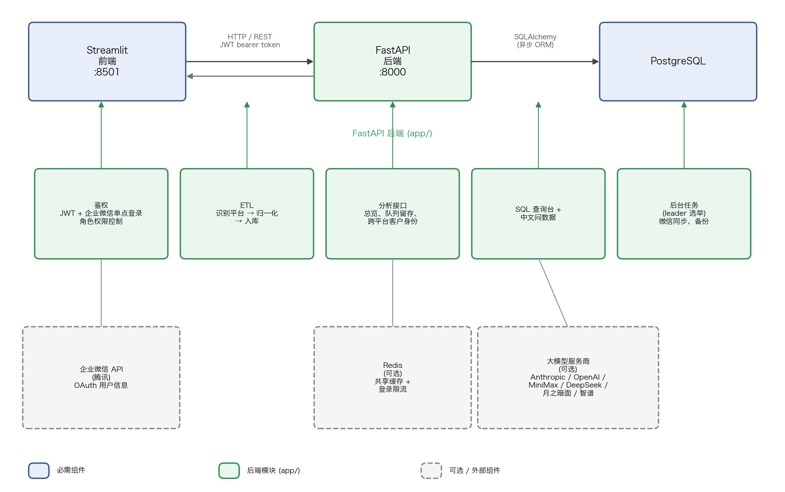

# OmniPanel

**基于官方导出数据的业务规则正确性分析平台** —— 仪表盘、队列留存、跨平台客户身份识别，以及中文问数据，一个自托管应用全部搞定。

[](https://github.com/Nanboy-Ronan/OmniPanel/actions/workflows/ci.yml)
[](LICENSE)
[](https://www.python.org/)
[](https://www.postgresql.org/)
[](CONTRIBUTING.md)

[English](README.md) | [中文](README.zh-CN.md)

---

## 目录

- [OmniPanel 是什么？](#omnipanel-是什么)
- [界面截图](#界面截图)
- [功能特性](#功能特性)
- [架构](#架构)
- [快速开始](#快速开始)
- [配置](#配置)
- [文档](#文档)
- [路线图](#路线图)
- [参与贡献](#参与贡献)
- [社区与支持](#社区与支持)
- [许可证](#许可证)

---

## OmniPanel 是什么？

通用 BI 工具只会在你给它的任何 schema 上画图——它不知道你这个平台上"客户"该怎么定义，哪些指标是累计值，多行记录该怎么去重。这些正确性的活，每个仪表盘、每条查询都要重新手动做一遍，永远做不完。

OmniPanel 反过来：**把业务规则在平台层一次性编码进去**，这样上面跑的每个仪表盘、每条 SQL、每次中文问数据，天生就是对的。

目前的第一个落地场景是中国电商和自媒体数据。把你从店铺后台和内容后台导出的表格上传进来（不涉及任何爬虫，全部基于各平台**官方提供的导出数据**），OmniPanel 会把它们归一化，编码进平台特有的业务规则（客户身份识别、复购窗口、哪些指标是累计值、去重逻辑），然后在这之上给你仪表盘、跨平台分析、有防护的 SQL 查询台，以及中文问数据。这是我们的起点，不是终点——同一套"摄入 → 归一化 → 编码业务规则 → 分析"的流程，未来会延伸到其他数据领域。

## 界面截图

> 以下数据均为随机生成的虚构数据集，不是真实店铺数据。

| 客户分析 | 队列留存 |
|---|---|
|  |  |

| 跨平台客户身份识别 | SQL 查询台 |
|---|---|
|  |  |

## 功能特性

### 数据摄入

- **多平台电商订单** —— 直接丢进有赞、京东、天猫的订单导出文件；通过列指纹自动识别平台来源，归一化到统一结构，同时保留平台原始行以便追溯。
- **自媒体数据** —— 微信公众号（通过微信接口自动同步）、小红书、知乎的每日图文/笔记指标，以及把发文时间和订单量做关联的内容 → 销量归因视图。

### 分析

- **客户分析** —— 新老客户拆分、复购率与复购周期、单客户订单历史、地区分布，以及按月队列留存曲线。
- **跨平台客户身份识别** —— 把同一个人在有赞/京东/天猫下的订单按手机号关联为一个客户，识别结果分精确/模糊两档置信度（京东手机号脱敏，模糊档用部分指纹匹配，与精确档结构隔离，避免误合并）。

### 查询层

- **SQL 查询台** —— 带严格防护的只读即席查询工具：仅允许 SELECT/WITH、自动加 LIMIT、语句超时、全程审计日志，支持保存和共享常用查询。
- **中文问数据 (NL-to-SQL)** —— 用中文直接提问，自动生成 SQL 并执行返回结果。支持多家大模型服务商（Anthropic、OpenAI、MiniMax、DeepSeek、月之暗面、智谱）；API Key 只保存在服务端，用户在下拉框里选服务商和模型。

### 安全与运维

- **角色、单点登录与审计** —— viewer / analyst / admin 三级角色；支持企业微信（WeCom）单点登录；每一次查询和写操作都会写入操作日志；管理员有用户管理界面。
- **后台任务** —— 微信指标同步和数据库月度备份都是自动定时运行，带 leader 选举，多个后端进程同时跑也安全。

### 为什么用官方导出数据，而不是爬虫

爬虫类工具处在法律灰色地带，而且经常因为平台改版或反爬升级就失效。OmniPanel 只摄入你自己合法拥有的**权威导出数据**——官方、结构化、稳定——把精力花在通用 BI 工具会跳过的正确性工作上。

<details>
<summary>和同类项目的对比</summary>

| 项目 | 数据来源 | 实际提供的是什么 |
|---|---|---|
| **OmniPanel**（本仓库） | 官方导出数据（有赞/京东/天猫，微信公众号/小红书/知乎） | 自托管应用：仪表盘、队列留存与跨平台身份识别、SQL 查询台、中文问数据 |
| [DA_Multi_Agent_Workflow](https://github.com/liuchaoqi-7/DA_Multi_Agent_Workflow) | 平台 API + 爬虫（抖音小店、小红书、视频号、广告平台） | 由 n8n 编排的多智能体 ETL/分析流水线，结果同步进飞书 |
| [ECommerceCrawlers](https://github.com/DropsDevopsOrg/ECommerceCrawlers) | 网页爬虫（淘宝、闲鱼、微博等 20+ 网站） | 爬虫代码示例/练习，不是可部署的产品 |
| [data-api (Just One API)](https://github.com/justoneapi/data-api) | 网页爬虫，覆盖 40+ 平台 | 托管型按调用计费的数据接口服务，没有分析层 |
| [bodapi global-ecommerce-data-scraping-solutions-cn](https://github.com/bodapi/global-ecommerce-data-scraping-solutions-cn) | 带反爬绕过的网页爬虫，覆盖 20+ 全球平台 | 面向跨境的托管型价格/评论/竞品情报数据服务 |

各项目做得更好的地方，以及 OmniPanel 做到了但它们都没做到的事，见 [docs/comparison.zh-CN.md](docs/comparison.zh-CN.md)。

</details>

## 架构



| 层 | 技术 | 职责 |
|---|---|---|
| 前端 | Streamlit（`app/ui/`） | 薄客户端——渲染后端响应；不含任何业务逻辑 |
| 后端 | FastAPI（`app/`） | 鉴权、ETL 流程、分析接口、SQL 查询台、后台任务 |
| 数据库 | PostgreSQL + SQLAlchemy | 统一归一化结构；原始平台行并排保留 |
| 缓存 / 限流 | Redis（可选） | 分布式缓存和登录限流；不配置时退化为进程内缓存 |

完整图（后端内部结构、企业微信单点登录流程、可选的 Redis/中文问数据层）和完整 API 一览见 [架构说明](docs/architecture.zh-CN.md)。

## 快速开始

依赖：Python 3.13+ 和一个 PostgreSQL 实例（13+）。

```bash
# 1. 克隆并安装依赖
git clone https://github.com/Nanboy-Ronan/OmniPanel.git
cd OmniPanel
python -m venv .venv && source .venv/bin/activate
pip install -r requirements.txt

# 2. 配置环境变量
cp .env.example .env
#    编辑 .env：设置 RAP_DATABASE_URL、RAP_SECRET，以及（可选）某个大模型的 API Key

# 3. 执行数据库迁移
make db-upgrade            # 等价于：alembic upgrade head

# 4. 启动后端（FastAPI，端口 8000）
uvicorn app.main:app --host 0.0.0.0 --port 8000

# 5. 在另一个终端启动前端（Streamlit，端口 8501）
streamlit run app/ui/dashboard.py
```

打开 Streamlit 页面后，注册第一个用户（会自动成为 admin），就可以开始上传导出文件了。完整步骤见[快速上手](docs/getting-started.zh-CN.md)。

## 配置

所有配置项都来自环境变量（完整列表见 `.env.example`）。最核心的几项：

| 变量 | 用途 |
|---|---|
| `RAP_DATABASE_URL` | PostgreSQL 连接串（`postgresql+asyncpg://…`） |
| `RAP_SECRET` | 用于签发登录令牌的密钥——请设置强随机值（`python -c "import secrets; print(secrets.token_urlsafe(48))"` 生成） |
| `CORS_ORIGINS` | 允许访问 API 的来源域名，逗号分隔 |

### 启用中文问数据 (NL-to-SQL)

可选功能。给你想用的服务商配置好 API Key 即可；用户在 SQL 查询台的下拉框里选择服务商和模型。Key 永远不会离开服务端。

```dotenv
NL_SQL_PROVIDER=minimax            # 默认服务商
MINIMAX_API_KEY=...                # 或 ANTHROPIC_API_KEY / DEEPSEEK_API_KEY / ……
```

不配置任何 Key 时，该功能只会返回 503，不影响其他功能。

## 文档

| 文档 | 内容 |
|---|---|
| [快速上手](docs/getting-started.zh-CN.md) | 安装、配置、运行、创建首个管理员 |
| [架构说明](docs/architecture.zh-CN.md) | 各组件、数据模型、ETL 流程、角色权限、API 一览、配置项全表 |
| [中文问数据 (NL-to-SQL)](docs/nl-to-sql.zh-CN.md) | 工作原理、服务商注册表、如何新增服务商 |
| [测试指南](docs/testing.zh-CN.md) | 如何跑测试、合成数据集、跳过的测试 |
| [微信自动同步](docs/wechat-auto-sync.zh-CN.md) | 公众号指标的每日后台自动同步 |
| [与同类项目的对比](docs/comparison.zh-CN.md) | 和爬虫类、智能体工作流类替代方案的诚实优劣对比 |

## 路线图

近期计划：

- **Docker / docker-compose 部署方案** —— 从 `git clone` 到运行起来，一套容器化路径
- **抖音小店 & 视频号数据接入** —— 目前两个平台还没有稳定的官方导出，持续跟进
- **飞书 / 钉钉推送** —— 把已保存查询的结果发送到团队日常使用的工具里

正在考虑中（欢迎在 [Discussion](https://github.com/Nanboy-Ronan/OmniPanel/discussions) 里参与讨论）：

- 多步 NL-to-SQL（supervisor-agent 路由，处理模糊或多跳问题）
- 数据仓库分层（ODS → DWD → DIM → ADS）
- 管理员操作日志页面的用量可视化

## 参与贡献

欢迎提 Issue 和 PR。详见 [CONTRIBUTING.md](CONTRIBUTING.md)（英文）：

- 如何搭建本地开发环境
- 代码风格与 commit 规范
- 如何新增平台连接器或 NL-to-SQL 服务商
- PR 提交前的检查清单

## 社区与支持

- **提问与想法** —— [GitHub Discussions](https://github.com/Nanboy-Ronan/OmniPanel/discussions)
- **Bug 与功能请求** —— [GitHub Issues](https://github.com/Nanboy-Ronan/OmniPanel/issues)
- **安全漏洞** —— 见 [SECURITY.md](SECURITY.md)（请勿公开提 Issue）

## 许可证

OmniPanel 采用 [GNU Affero General Public License v3.0](LICENSE)（AGPL-3.0）授权。

你可以自由使用、修改和自托管 OmniPanel。如果你分发修改后的版本，或将修改后的版本作为网络服务运行，必须以相同许可证开放源代码。
