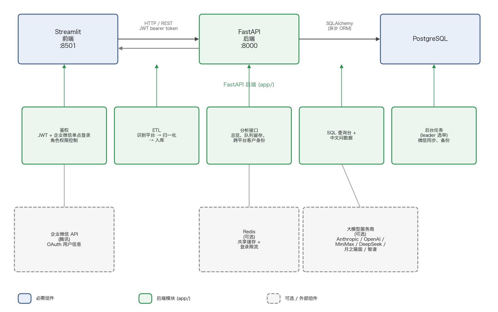

# OmniPanel

**把电商和自媒体的平台数据，变成干净的仪表盘、客户分析和自然语言查询 —— 自托管，零爬虫。**

[](https://github.com/Nanboy-Ronan/OmniPanel/actions/workflows/ci.yml)
[](LICENSE)
[](https://www.python.org/)
[](https://www.postgresql.org/)
[](CONTRIBUTING.md)
[](https://github.com/Nanboy-Ronan/OmniPanel/stargazers)

[English](README.md) | [中文](README.zh-CN.md)

---

## OmniPanel 是什么？

你在有赞、京东、天猫上卖货，也在公众号、小红书、知乎上做内容。每个平台都有数据，但拿出来的格式各不相同 —— 几十个列名不一样的表格、不同平台对"客户"的定义不一样、有些指标是累计值、同一笔订单可能有多行记录需要去重。

通用 BI 工具（如 Tableau、Metabase）不会替你处理这些问题。它们只是在你给的表结构上画图，至于图上画的东西对不对，全靠你自己。

**OmniPanel 替你把这些脏活干了。** 数据怎么进来，取决于平台：

- **有 API 的平台**（微信公众号）—— 配置一次，后台每天自动拉取
- **有创作者后台的平台**（小红书、知乎）—— 内置采集代理，自动登录后台导出
- **只有导出文件的平台**（有赞、京东、天猫订单）—— 上传 Excel，自动识别平台来源

不管哪种方式，进来的数据都会自动：

- 🏷️ **识别平台** —— 根据列名指纹判断数据来自哪个平台
- 🔄 **归一化** —— 把不同平台的数据，统一成同一套字段（客户、金额、时间、地区……）
- 📊 **给你分析** —— 仪表盘、客户画像、队列留存、跨平台客户合并、SQL 查询台、中文问数据

所有数据来源都是**平台官方渠道**（官方 API、官方导出功能）—— 不涉及爬虫，不走灰色地带。

### 使用流程

数据进来有两种方式，之后的分析体验是一样的：

```
方式一：自动同步                    方式二：手动上传
（公众号 / 小红书 / 知乎）          （有赞 / 京东 / 天猫订单）
        │                                    │
        └──────────┬─────────────────────────┘
                   ▼
        OmniPanel 识别 → 归一化 → 入库
                   ▼
        仪表盘 · 客户分析 · SQL 查询台 · 中文问数据
```

- **自动同步**：配置一次平台账号，之后每天后台自动拉取最新数据，无需人工干预
- **手动上传**：从平台后台导出文件，拖进 OmniPanel，自动识别平台来源后入库（内容哈希去重，重复上传不会产生脏数据）
- **分析**：打开仪表盘看数据，在 SQL 查询台写 SQL，或直接用中文提问（比如"上个月广东地区复购率是多少"）

---

## 界面截图

> 以下数据均为随机生成的虚构数据集，非真实企业数据。

| 客户分析 | 队列留存 |
|---|---|
|  |  |

| 跨平台客户身份识别 | SQL 查询台 |
|---|---|
|  |  |

---

## 功能

### 数据接入

| 类型 | 支持平台 | 接入方式 |
|---|---|---|
| 电商订单 | 有赞、京东、天猫 | 上传官方导出文件（.xlsx / .xls / .csv），自动识别平台 |
| 公众号 | 微信公众号 | 微信 API 自动同步（每天定时拉取），无需手动操作 |
| 内容平台 | 小红书、知乎 | 上传官方导出文件 或 使用内置的自动采集代理 |

> 上传采用内容哈希去重，同一份文件传多次不会产生重复数据。

### 电商分析

- **客户总览** —— 新老客户构成、复购率和复购间隔、单客户订单历史、地区分布
- **队列留存** —— 按月分组，跟踪每组客户的后续购买留存曲线（含右删失处理）
- **订单明细** —— 所有归一化订单的可浏览、可导出视图
- **跨平台客户识别** —— 把同一个人在不同平台的订单按手机号合并，分为精确匹配和模糊匹配两档（京东手机号脱敏，模糊档用部分指纹匹配，与精确档结构隔离）

### 内容分析

- **公众号流量** —— 每日阅读、分享、新增关注等指标的趋势和对比
- **内容带货** —— 发文时间与订单量的关联分析，帮助判断内容对销售的拉动效果

### 查询层

- **SQL 查询台** —— 只读的即席查询工具，严格受控：只允许 SELECT / WITH、自动加 LIMIT、语句超时、全程审计日志。支��保存和共享常用查询。
- **中文问数据 (NL-to-SQL)** —— 用中文输入问题，自动生成 SQL 并返回结果。支持 Anthropic、OpenAI、MiniMax、DeepSeek、月之暗面、智谱等多家大模型；API Key 只存在服务端，用户在下拉框里选服务商和模型即可。

### 安全与运维

- **三级角色** —— viewer（只读）/ analyst（可上传和分析）/ admin（用户管理、数据库操作）
- **企业微信 SSO** —— 可选，支持扫码登录
- **审计日志** —— 每次查询和写操作都记录到不可修改的操作日志
- **后台任务** —— 微信指标自动同步、数据库月度备份，均带 leader 选举保障多进程安全
- **看门狗** —— 每天检查各后台任务是否正常运行，异常时通过企业微信机器人告警

---

## 为什么走官方渠道，不用爬虫？

爬虫方案有三个硬伤：

- **法律风险** —— 处于灰色地带，不同平台的用户协议态度不一
- **脆弱** —— 平台改版或升级反爬策略，爬虫就可能失效
- **维护成本高** —— 需要持续跟进每个平台的前端变化

OmniPanel 只通过官方渠道拿数据 —— 有 API 的走 API（公众号），有创作者后台的走官方后台导出（小红书、知乎），其余的走平台提供的导出功能（电商订单）。这些都是平台授权、结构稳定的数据来源，不受前端改版影响。把精力花在通用 BI 工具不会替你做的那一层正确性工作上，而不是花在和平台对抗反爬机制上。

<details>
<summary>和同类项目的对比</summary>

| 项目 | 数据来源 | 实际交付 |
|---|---|---|
| **OmniPanel**（本仓库） | 官方渠道：API + 官方导出（有赞/京东/天猫，公众号/小红书/知乎） | 自托管应用：仪表盘、队列留存、跨平台客户识别、SQL 查询台、中文问数据 |
| [DA_Multi_Agent_Workflow](https://github.com/liuchaoqi-7/DA_Multi_Agent_Workflow) | 平台 API + 爬虫（抖音小店、小红书、视频号、广告平台） | n8n 编排的多��能体 ETL/分析流水线，结果同步到飞书 |
| [ECommerceCrawlers](https://github.com/DropsDevopsOrg/ECommerceCrawlers) | 网页爬虫（淘宝、闲鱼、微博等 20+ 网站） | 爬虫代码示例，非可部署产品 |
| [data-api (Just One API)](https://github.com/justoneapi/data-api) | 网页爬虫，40+ 平台 | 托管型按调用计费的数据接口，无分析层 |
| [bodapi global-ecommerce-data-scraping-solutions-cn](https://github.com/bodapi/global-ecommerce-data-scraping-solutions-cn) | 带反爬绕过的网页爬虫，20+ 全球平台 | 面向跨境的托管型数据服务 |

详见 [docs/comparison.zh-CN.md](docs/comparison.zh-CN.md)。

</details>

---

## 架构

```
浏览器 (Streamlit, :8501) ──→ 后端 API (FastAPI, :8000) ──→ PostgreSQL
                                       │
                                  ┌─────┴─────┐
                                  │  Redis     │ (可选，缓存 / 限流)
                                  │  大模型 API │ (可选，NL-to-SQL)
                                  └───────────┘
```



| 层 | 技术 | 职责 |
|---|---|---|
| 前端 | Streamlit（`app/ui/`） | 薄客户端 —— 只负责渲染后端数据，不含业务逻辑 |
| 后端 | FastAPI（`app/`） | 鉴权、ETL、分析接口、SQL 查询台、后台任务 |
| 数据库 | PostgreSQL + SQLAlchemy | 统一的归一化表结构，同时保留各平台原始数据 |
| 缓存 | Redis（可选） | 分布式缓存和登录限流；不配置时退化为进程内缓存 |

详见 [架构说明](docs/architecture.zh-CN.md)。

---

## 快速开始

### Docker（推荐）

需要 Docker + Docker Compose v2。一键启动 Postgres、FastAPI 和 Streamlit，本机不需要装 Python 或 Postgres。

```bash
git clone https://github.com/Nanboy-Ronan/OmniPanel.git
cd OmniPanel
cp .env.example .env
#    编辑 .env：把 RAP_SECRET 设为一个随机的强密钥
#    python -c "import secrets; print(secrets.token_urlsafe(48))"
docker compose up --build
```

打开 http://localhost:8501，注册第一个用户（自动成为管理员），然后上传导出文件即可。

### 手动安装

需要 Python 3.13+ 和 PostgreSQL 13+。

```bash
# 1. 克隆并安装依赖
git clone https://github.com/Nanboy-Ronan/OmniPanel.git
cd OmniPanel
python -m venv .venv && source .venv/bin/activate
pip install -r requirements.txt

# 2. 配置
cp .env.example .env
#    编辑 .env：设置 RAP_DATABASE_URL、RAP_SECRET，（可选）大模型 API Key

# 3. 数据库迁移
make db-upgrade            # 等价于 alembic upgrade head

# 4. 启动后端（FastAPI，端口 8000）
uvicorn app.main:app --host 0.0.0.0 --port 8000

# 5. 另开终端，启动前端（Streamlit，端口 8501）
streamlit run app/ui/dashboard.py
```

完整步骤见 [快速上手](docs/getting-started.zh-CN.md)。

---

## 配置

所有配置通过环境变量设置��完整列表见 `.env.example`）。

### 核心配置

| 变量 | 用途 |
|---|---|
| `RAP_DATABASE_URL` | PostgreSQL 连接串 |
| `RAP_SECRET` | 签发 JWT 的密钥 —— **必须修改**，用 `python -c "import secrets; print(secrets.token_urlsafe(48))"` 生成 |
| `RAP_SECRET_PREVIOUS` | 旧的 `RAP_SECRET`（逗号分隔），用于密钥轮换期间继续校验旧令牌 |
| `FORWARDED_ALLOW_IPS` | 反向代理场景下信任的 IP（默认 `127.0.0.1`） |

### 启用中文问数据

配置对应服务商的 API Key 即可，用户在下拉框中选择服务商和模型。Key 不会离开服务端。

```dotenv
NL_SQL_PROVIDER=minimax            # 默认服务商
MINIMAX_API_KEY=eyJ...             # 或 ANTHROPIC_API_KEY / DEEPSEEK_API_KEY 等
```

不配置时，该功能返回 503，不影响其他功能。

### 密钥轮换

直接更换 `RAP_SECRET` 会强制所有用户下线。配合 `RAP_SECRET_PREVIOUS` 可以实现无缝轮换：

1. 生成新密钥，把当前 `RAP_SECRET` 的值移到 `RAP_SECRET_PREVIOUS`，`RAP_SECRET` 设为新值，重启。
2. 等待 `TOKEN_LIFETIME_SECONDS`（默认 24 小时），确保旧令牌全部过期。
3. 删除 `RAP_SECRET_PREVIOUS`，重启。

> 如果怀疑旧密钥已泄露，跳过步骤 2 的等待，立即处理。

---

## 文档

| 文档 | 内容 |
|---|---|
| [快速上手](docs/getting-started.zh-CN.md) | 安装、配置、运行、创建管理员 |
| [架构说明](docs/architecture.zh-CN.md) | 组件关系、数据模型、ETL 流程、角色权限、API 一览、全量配置项 |
| [中文问数据](docs/nl-to-sql.zh-CN.md) | 工作原理、服务商注册、如何新增服务商 |
| [测试指南](docs/testing.zh-CN.md) | 跑测试、合成数据集 |
| [微信自动同步](docs/wechat-auto-sync.zh-CN.md) | 公众号指标每日自动同步 |
| [自动采集代理](docs/collector.zh-CN.md) | Playwright 自动化小红书/知乎/蒲公英创作者后台导出 |
| [依赖维护](docs/maintenance.zh-CN.md) | 升级节奏、关键包清单 |
| [同类项目对比](docs/comparison.zh-CN.md) | 与爬虫和智能体方案的优势/劣势对比 |

---

## 路线图

正在推进：

- **抖音小店 & 视频号** —— 两个平台尚无稳定的官方导出，持续跟踪
- **飞书 / 钉钉推送** —— 将已保存的查询结果推送到团队协作工具

考虑中（欢迎在 [Discussion](https://github.com/Nanboy-Ronan/OmniPanel/discussions) 参与讨论）：

- 多步 NL-to-SQL（supervisor-agent 路由，处理模糊或多跳问题）
- 数据仓库分层（ODS → DWD → DIM → ADS）
- 管理后台用量可视化

---

## 参与贡献

欢迎提 Issue 和 PR。详见 [CONTRIBUTING.md](CONTRIBUTING.md)（英文）：

- 本地开发环境搭建
- 代码风格与提交规范
- 如何新增平台连接器或 NL-to-SQL 服务商
- PR 提交前检查清单

---

## 社区与支持

- **提问与讨论** —— [GitHub Discussions](https://github.com/Nanboy-Ronan/OmniPanel/discussions)
- **Bug 与功能请求** —— [GitHub Issues](https://github.com/Nanboy-Ronan/OmniPanel/issues)
- **安全漏洞** —— 见 [SECURITY.md](SECURITY.md)，请勿公开提 Issue

---

## 许可证

OmniPanel 采用 [GNU Affero General Public License v3.0](LICENSE)（AGPL-3.0）。

可自由使用、修改和自托管。分发修改版本或将其作为网络服务运行，须以相同许可证开放源代码。
